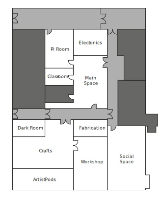

# Facilities

This section will give a quick overview of our facilities and the tools within.

Here is a quick floorplan view of the hackspace:

{: style="height:500px;width:500px"}

At the moment the main entrance to the hackspace is via the Pi Room. Most rooms will be locked unless being actively used, and its suggested that you pop in to the Pi Room to make yourself known. 