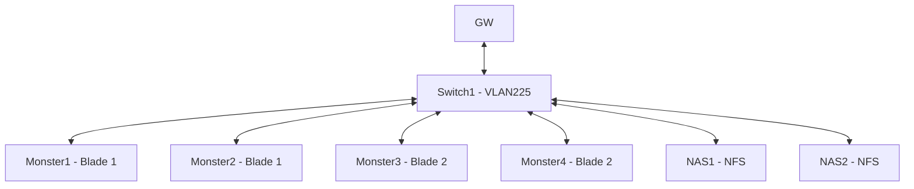
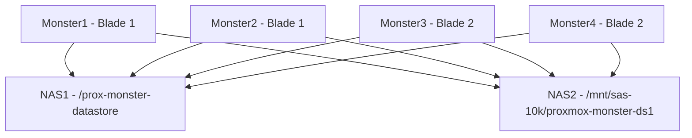

# Proxmox Clusters

Currently we have one operational Proxmox cluster, 'monster', which has enough CPU and Memory for anything we'll need in the hackspace.

## Hardware

The cluster is made up of a single [HP SL2x170z G6](https://support.hpe.com/hpesc/public/docDisplay?docId=emr_na-c01800572), which has two blades it it, totalling 4 systems. Rough specs of each are:

* 2 x [Intel® Xeon® Processor X5550](https://www.intel.com/content/www/us/en/products/sku/37106/intel-xeon-processor-x5550-8m-cache-2-66-ghz-6-40-gts-intel-qpi/specifications.html)
* 64GB DDR3
* 128GB local SSD
* 2 x HP NC362i Gigabit Ethernet
* 1 x Dedicated LO100 port

## Network Layout

All nodes, gateway, and the NAS are on [VLAN225](../../network_layout.md#shared-services---vlan-225). The Proxmox nodes are connected via their 2nd ethernet port, which also has shared LO100 enabled on them.

## Storage Layout

## Admin Tasks

### Allowing users access to the Cluster

* Login to [https://monster.int.leighhack.org/](https://monster.int.leighhack.org/) as a Infra member.
* Click on 'Datacenter (monster)' in the left menu.
* Goto Users and find the user that requires access.
* Either add them to the 'Infra', or 'Members' group as needed.

### Login without using id.leighhack.org/Authentik

* Go to [https://monster.int.leighhack.org/](https://monster.int.leighhack.org/)
* On the login screen, select the dropdown and pick 'Linux PAM'
* Username is 'root', password is in the password manager.