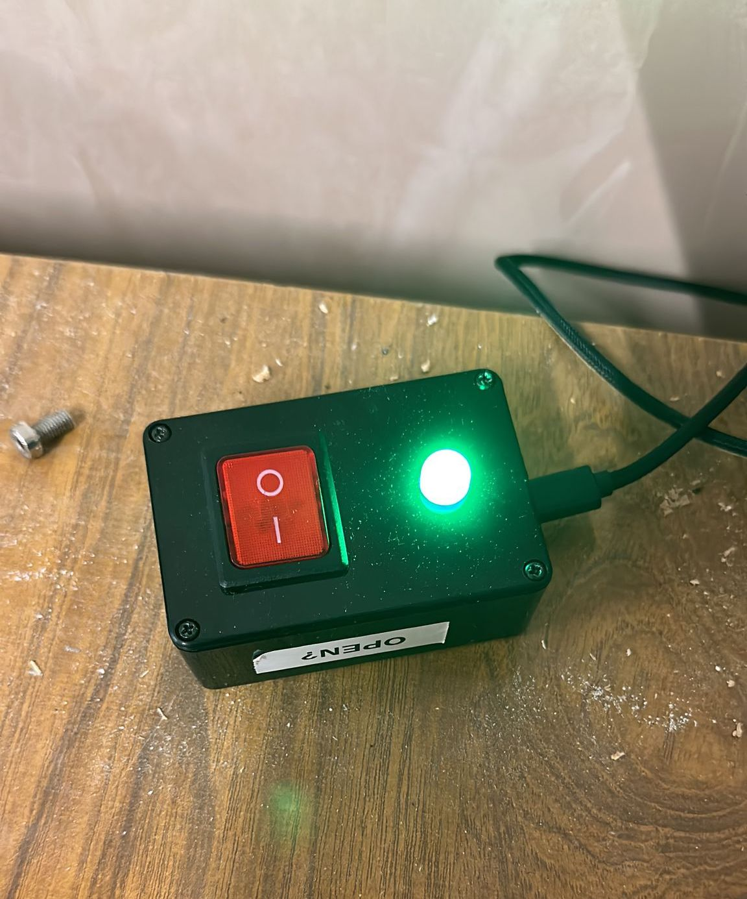
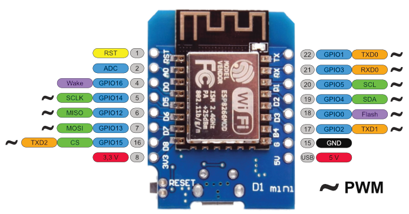

# Hackspace State Switch

The state switch is a physical switch located near the [Main Space](../../facilities/main_space.md) entrance doors. This small device provide a physical open/close indicator for the hackspace, and the status is made available via the Space API endpoint, Home Assistand, Slack bot, and website.

The device itself is a simple ESP8266 (A WeMoS D1-Mini clone with USB-C) with a RGB LED, and a rocker switch. It runs [ESPHome](https://esphome.io) and connects to our Home Assistant instance.

## Physical

* RGB LED is wired to D5, D6, D7, and controlled via PWM
* Switch is connected to D4

## Issues

Due to not reading the docs before fitting together, the switch is connected to D4, which is needed to be pulled high at boot, so if the switch is left in the "on" state, the device will not boot.

| Label | GPIO   | Input         | Output                | Notes                                                            |
| ----- | ------ | ------------- | --------------------- | ---------------------------------------------------------------- |
| D0    | GPIO16 | no interrupt  | no PWM or I2C support | HIGH at boot used to wake up from deep sleep                     |
| D1    | GPIO5  | OK            | OK                    | often used as SCL (I2C)                                          |
| D2    | GPIO4  | OK            | OK                    | often used as SDA (I2C)                                          |
| D3    | GPIO0  | pulled up     | OK                    | connected to FLASH button, boot fails if pulled LOW              |
| D4    | GPIO2  | pulled up     | OK                    | HIGH at boot connected to on-board LED, boot fails if pulled LOW |
| D5    | GPIO14 | OK            | OK                    | SPI (SCLK)                                                       |
| D6    | GPIO12 | OK            | OK                    | SPI (MISO)                                                       |
| D7    | GPIO13 | OK            | OK                    | SPI (MOSI)                                                       |
| D8    | GPIO15 | pulled to GND | OK                    | SPI (CS) Boot fails if pulled HIGH                               |
| RX    | GPIO3  | OK            | RX pin                | HIGH at boot                                                     |
| TX    | GPIO1  | TX pin        | OK                    | HIGH at boot debug output at boot, boot fails if pulled LOW      |
| A0    | ADC0   | Analog Input  | X                     |                                                                  |

## Source

The Hackspace State Switch uses ESPHome, and the config is available in the `esphome-config` repository in the Leigh Hackspace Github org:

[big-button.yaml](https://github.com/leigh-hackspace/esphome-config/blob/main/big-button.yaml)