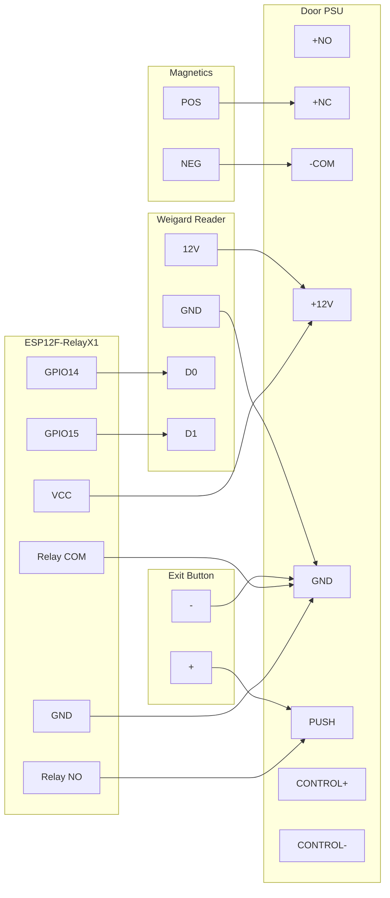

# Doors

## Hardware

* Door Magnetics PSU
* Weigard Compatible Reader/Pin Pad
* Magnetic lock
* Exit Button
* ESP12F-RelayX1 Board



## Software

ESPHome can be used to control the full system

```yaml
substitutions:
  devicename: pi-room-door
  friendly_name: Pi Room Door
  device_description: External Door in the Pi Room
  power_consumption: "0.5"
  open_delay: "5000"

esphome:
  name: "${devicename}"
  platform: ESP8266
  board: esp12e
  comment: "${device_description}"
  on_boot:
    priority: 600
    then:
    - lock.lock: door_mag

http_request:
  useragent: leighhack/${devicename}
  timeout: 10s

wiegand:
  - id: keypad
    d0: GPIO13
    d1: GPIO14
    on_key:
      - lambda: ESP_LOGI("KEY", "received key %d", x);
    on_tag:
      - lambda: ESP_LOGI("TAG", "received tag %s", x.c_str());
      - http_request.post:
          url: https://api.leighhack.org/api/v1/rfid_check
          headers:
            Content-Type: application/json
          json:
            uid: !lambda 'return x;'
          verify_ssl: false
          on_response:
            then:
              - if:
                  condition:
                    lambda: "return status_code == 200;"
                  then:
                    - logger.log:
                        format: "Tag valid, unlocking door..."
                    - lock.unlock: door_mag
                    - mqtt.publish_json:
                        topic: door_log
                        payload: |-
                          root["door"] = "${devicename}";
                          root["uid"] = x;

key_collector:
  - id: pincode_reader
    source_id: keypad
    min_length: 4
    max_length: 4
    end_keys: "#"
    end_key_required: true
    back_keys: "*"
    clear_keys: "C"
    allowed_keys: "0123456789"
    timeout: 5s
    on_result:
      - logger.log:
          format: "input result: '%s', started by '%c', ended by '%c'"
          args:
            [
              "x.c_str()",
              "(start == 0 ? '~' : start)",
              "(end == 0 ? '~' : end)",
            ]
    on_timeout:
      - logger.log:
          format: "input timeout: '%s', started by '%c'"
          args: ["x.c_str()", "(start == 0 ? '~' : start)"]

output:
  - platform: gpio
    pin: GPIO5
    id: door_mag_output
    inverted: true

lock:
  - platform: output
    id: door_mag
    output: door_mag_output
    name: "Door Mag"
    on_unlock:
      - logger.log:
          format: "Door Unlocked"
      - delay: "${open_delay}ms"
      - lock.lock: door_mag
      - logger.log:
          format: "Door Locked"
```