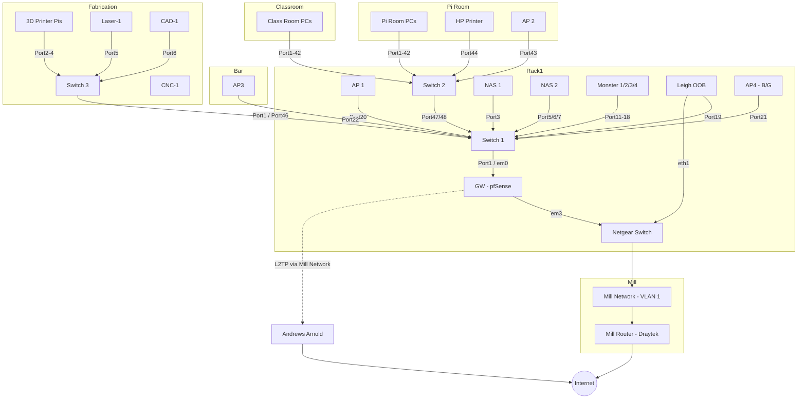
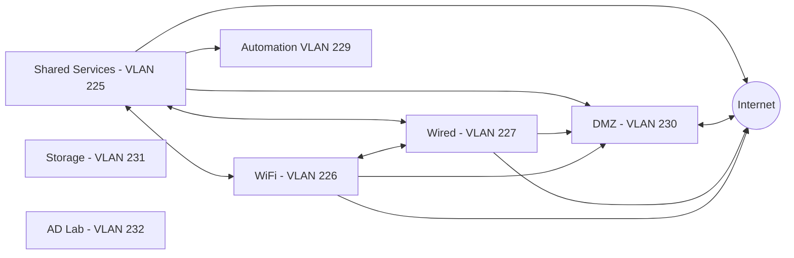

# Network Layout

## Physical Network Layout

## Hardware

| Name         | Manf         | Model                   | Type      | Location      | Status | Notes                                                           |
| ------------ | ------------ | ----------------------- | --------- | ------------- | ------ | --------------------------------------------------------------- |
| GW           | HP           | Unknown                 | Router    | Rack 1        | Live   | HP desktop system running pfSense                               |
| Switch 1     | HP           | Procurve 2510-48G       | L2 Switch | Rack 1        | Live   | For Rack 1 hardware                                             |
| Switch 2     | HP           | Procurve 2510-48G       | L2 Switch | Rack 1        | Live   | For wired clients in the rooms                                  |
| Switch 3     | HP           | Procurve 2824           | L2 Switch | Fabrication   | Live   | Switch for the fabrication area                                 |
| AP 1         | Linksys      | WRT1900ACS              | AP        | Top of Rack   | Live   | Uses stock firmware                                             |
| AP 2         | BT           | Business Hub 5 Type A   | AP        | Pi Room       | Live   | Uses stock firmware (supports OpenWRT)                          |
| AP 3         | Cisco        | RV110W                  | AP        | Bar           | Live   | Uses stock firmware                                             |
| AP 4         | Linksys      | Wireless-G ADSL Gateway | AP        | Behind Rack 1 | Live   | B/G Only network for old devices                                |
| NAS 1        | QNAP         | TS-431+                 | NAS       | Rack 1        | Live   |                                                                 |
| NAS 2        | HP           | Microserver G8          | NAS       | Rack 1        | Live   |                                                                 |
| UPS          | APC          | ???                     | UPS       | Rack 1        | Live   | Powers the NAS systems only                                     |
| Leigh OOB    | Raspberry Pi | 2 B+                    | Server    | Rack 1        | Live   | Gives us 'out of band' access to Hackspace network and devices  |
| Mini Switch  | Netgear      | ???                     | L2 Switch | Rack 1        | Live   | Multiple ports on the Mill network, needs switching to Switch 1 |
| Blade Server | HP           | SL2x170z G6             | Server    | Rack 1        | Live   | Proxmox Cluster 'Monster'                                       |

## L3 Layout / VLANs

TL;DR: All VLANs can access Shared Services, Automation is only accessible via Shared Services.

### Mill Network - VLAN '1'

The mill provides internet access via a 100mbps internal network. It can be a bit unreliable but it works for our general usage. 

* ISP: [Awareness Software Ltd](https://aware-soft.com/) (AS34931)
* Mill Network Administrator: [Mark Nightingale](mailto:data@imagevillage.co.uk), Image Village.

Access to the mill network is provided by a singular CAT5 delivered to the rear of the main space, just above where Rack 1 is.

* VLAN: 1 (untagged)
* Subnet: `192.168.20.0/24`
* Gateway: `192.168.20.1`
* DHCP Enabled

Usage is bound by the [LBPT Tenant Network Agreement](mill_network_tc.md).

### Shared Services - VLAN 225

Where the servers, routers, and other central bits are hosted.

IP Range: `10.3.1.0/24`

The range is split into logical groups:

* `1` to `9` - Network hardware
* `10` to `19` - Physical Servers
* `20` to `29` - Physical Server Management Interfaces
* `30` to `49` - VMs
* `50` to `59` - Printers

This subnet does have DHCP enabled, but we encourage static assignments for critical hardware and services. Here is the current list:

| Device Name       | IP Address  | Location                 |
| ----------------- | ----------- | ------------------------ |
| GW                | `10.3.1.1`  | Rack 1                   |
| Switch 1          | `10.3.1.2`  | Rack 1                   |
| Switch 2          | `10.3.1.3`  | Rack 1                   |
| Switch 3          | `10.3.1.4`  | Workshop / Fabrication   |
| NAS 1             | `10.3.1.5`  | Rack 1                   |
| NAS 2             | `10.3.1.6`  | Rack 1                   |
| Monster 1         | `10.3.1.11` | Rack 1                   |
| Monster 2         | `10.3.1.12` | Rack 1                   |
| Monster 3         | `10.3.1.13` | Rack 1                   |
| Monster 4         | `10.3.1.14` | Rack 1                   |
| Leigh OOB         | `10.3.1.21` | Rack 1                   |
| Monster 1 LO100   | `10.3.1.22` | Rack 1                   |
| Monster 2 LO100   | `10.3.1.23` | Rack 1                   |
| Monster 3 LO100   | `10.3.1.24` | Rack 1                   |
| Monster 4 LO100   | `10.3.1.25` | Rack 1                   |
| NAS 2 iLO         | `10.3.1.26` | Rack 1                   |
| Apps1             | `10.3.1.30` | Monster                  |
| MX1               | `10.3.1.31` | Monster                  |
| k8s-lab-01        | `10.3.1.32` | Monster                  |
| k8s-lab-02        | `10.3.1.33` | Monster                  |
| k8s-lab-03        | `10.3.1.34` | Monster                  |
| Cobalt RAQ3       | `10.3.1.35` | Monster                  |
| Authentik         | `10.3.1.36` | Monster                  |
| RTSP              | `10.3.1.37` | Monster                  |
| Discourse         | `10.3.1.38` | Monster                  |
| Web1              | `10.3.1.39` | Monster                  |
| HP Laserjet P3015 | `10.3.1.50` | Pi Room 5/7              |
| GW - VIP 1        | `10.3.1.60` | VIP for Internal HAProxy |
| GW - VIP 2        | `10.3.1.61` | VIP for K8s-Lab          |

### WiFi - VLAN 226

WiFi users, General open access to the internet and internal services. The UnFi APs management interface is in Shared Services on DHCP, only non-UnFi devices are assigned a static IP on the WiFi VLAN.

IP Range: `10.3.2.0/24`

DHCP enabled, `10.3.2.21 - 10.3.2.254`

| Device Name | IP Address  | Location                |
| ----------- | ----------- | ----------------------- |
| AP4         | `10.3.2.5`  | Behind Rack 1           |
| Cam1        | `10.3.2.6`  | Rack 1                  |
| Cam2        | `10.3.2.7`  | Defunct                 |
| Cam3        | `10.3.2.8`  | Social Space            |
| Cam4        | `10.3.2.9`  | Main Space              |
| Cam5        | `10.3.2.10` | Pi Room                 |
| Cam6        | `10.3.2.11` | Workshop                |
| Cam7        | `10.3.2.12` | CNC                     |

Channel layouts for the APs:

| Device | 2.4ghz | 5ghz | 6ghz |
| ------ | ------ | ---- | ---- |
| AP1    | Auto   | Auto | N/A  |
| AP2    | Auto   | Auto | N/A  |
| AP3    | Auto   | Auto | N/A  |
| AP4    | 13     | N/A  | N/A  |

### Wired - VLAN 227

The general hackspace wired network. This covers the Pi Room, Classroom, Electronics, and Fabrication.

IP Range: `10.3.14.0/24`

DHCP enabled, `10.3.14.2 - 10.3.14.254`

### Automation - VLAN 229

Used for any automation devices that do not require open internet access, or need to be secured away from the general network (e.g. Door system).

Accessible via `Leighhack-iot` WiFi SSID.

IP Range `10.3.16.0/24`

DHCP enabled, `10.3.16.2 - 10.3.16.128`

This subnet does have DHCP enabled, but we use some static assignment. Here is the current list:

| Device Name | IP Address | Location |
| ----------- | ---------- | -------- |

### DMZ - VLAN 230

Used for internet facing services, all systems are allocated addresses within the A&A delegated IP range.

IP Range: `81.187.195.16/29`

| Device Name | IP Address      | Location |
| ----------- | --------------- | -------- |
| GW          | `81.187.195.17` | Rack 1   |

### Storage - VLAN 231

Non-routed VLAN for VM hosts to connect to storage devices either via iSCSI or NFS, to keep that main broadcast traffic off the main subnets.

**Currently not implemented**

IP Range: `10.254.254.0/24`

| Device Name | IP Address      | Location |
| ----------- | --------------- | -------- |
| `nas02`     | `10.254.254.2`  |          |
| `monster1`  | `10.254.254.11` |          |
| `monster2`  | `10.254.254.12` |          |
| `monster3`  | `10.254.254.13` |          |
| `monster4`  | `10.254.254.14` |          |
| `monster5`  | `10.254.254.15` |          |

### AD Lab - VLAN 232

IP Range: `192.168.10.0/24`

A non-routed VLAN for our Active Directory lab - [GOAD](https://github.com/leigh-hackspace/GOAD)

Consult the GOAD documentation for the breakdown of systems within the environment.

### OpenVPN

The pfSense has a OpenVPN server, this allocates IPs in the `10.3.254.0/24` range and is available as a normal interface on pfSense, but it doesn't have a VLAN assigned to it.

### OOB Access

Out of band access to the network is available via 'Leigh OOB', this uses Tailscale to handle situations where GW or the L2TP is unavailable.

For access, contact the [Infra team](../membership/useful_contacts.md#tech-infrastructure), or Andrew Williams.
