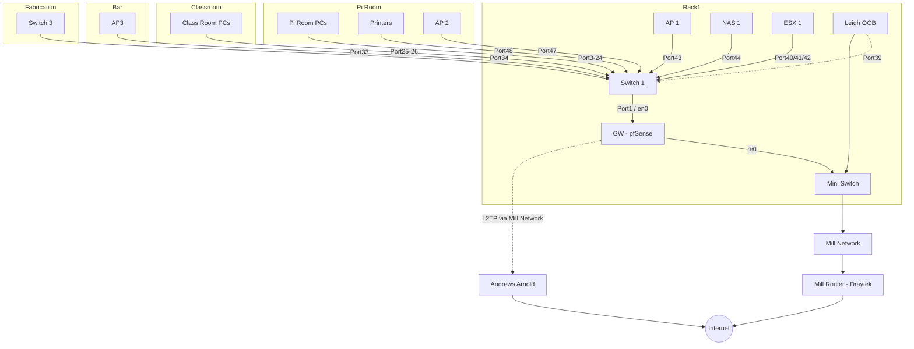
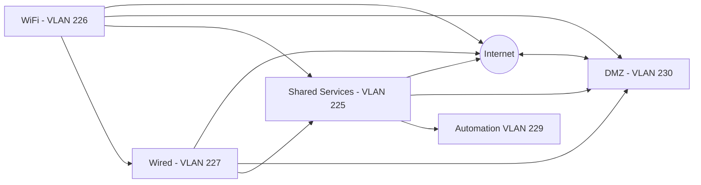

# Network Layout

## Physical Network Layout

Correct as of 2023-06-22

## Hardware

| Name         | Manf         | Model          | Type      | Location    | Status                  | Notes                                                                |
| ------------ | ------------ | -------------- | --------- | ----------- | ----------------------- | -------------------------------------------------------------------- |
| GW           | HP           | Unknown        | Router    | Rack 1      | Live                    | HP desktop system running pfSense                                    |
| Switch 1     | Cisco        | Catalyst 3560G | L3 Switch | Rack 1      | Live                    |                                                                      |
| Switch 2     | Cisco        | Catalyst 3560G | L3 Switch | Rack 1      | Waiting to be installed | Sandbox/Learning switch                                              |
| Switch 3     | HP           | Procurve 2824  | L2 Switch | Fabrication | Live                    | Switch for the fabrication area                                      |
| AP 1         | Linksys      | WRT1900ACS     | AP        | Top of Rack | Live                    | Uses stock firmware                                                  |
| AP 2         | Netgear      | WNR2000        | AP        | Pi Room     | Live                    |                                                                      |
| AP 3         | Cisco        | RV110W         | AP        | Bar         | Live                    |                                                                      |
| NAS 1        | QNAP         | TS-431+        | NAS       | Rack 1      | Live                    |                                                                      |
| UPS          | APC          | ???            | UPS       | Rack 1      | Live                    |                                                                      |
| ESX 1        | Dell         | R320           | Server    | Rack 1      | Live                    |                                                                      |
| Leigh OOB    | Raspberry Pi | 2 B+           | Server    | Rack 1      | Live                    | Gives us 'out of band' access to Hackspace network and devices       |
| Mini Switch  | Gigabyte     | ???            | L2 Switch | Rack 1      | Live                    | Multiple ports on the Mill network, needs switching to Switch 1      |
| Blade Server | HP           | SL2x170z G6    | Server    | Rack 1      | Waiting to be installed | Donated by Chris D, possible future Kube/Proxmox/vSphere lab cluster |

## L3 Layout / VLANs

TL;DR: All VLANs can access Shared Services, Automation is only accessible via Shared Services.

### Mill Network - VLAN '50'

Our outbound internet route, should be treated as untrusted due to relatively little control over devices in other businesses. Our port seems to be be on VLAN 50 on the Mill's switch infrastructure and is a 100mbps port. `192.168.20.1` is our gateway, which is a DrayTek 2865.

The mill switch network and internet access is managed by Image Village, and the ISP is Awareness Software Limited (AS34931).

IP Range: `192.168.20.0/24`

### Shared Services - VLAN 225

Where the servers, routers, and other central bits are hosted.

IP Range: `10.3.1.0/24`

The range is split into logical groups:

* `1` to `9` - Network hardware
* `10` to `19` - Physical Servers
* `20` to `29` - Physical Server Management Interfaces
* `30` to `49` - VMs
* `50` to `59` - Printers

This subnet doesn't have DHCP enabled, we use static assignment. Here is the current list:

| Device Name       | IP Address  | Location               |
| ----------------- | ----------- | ---------------------- |
| GW                | `10.3.1.1`  | Rack 1                 |
| Switch 1          | `10.3.1.2`  | Rack 1                 |
| Switch 3          | `10.3.1.4`  | Workshop / Fabrication |
| NAS 1             | `10.3.1.5`  | Rack 1                 |
| ESX 1             | `10.3.1.10` | Rack 1                 |
| ESX 1 iDRAC       | `10.3.1.20` | Rack 1                 |
| Leigh OOB         | `10.3.1.21` | Rack 1                 |
| Apps1             | `10.3.1.30` | ESX 1                  |
| HP Laserjet P3015 | `10.3.1.50` | Pi Room 5/7            |

### WiFi - VLAN 226

WiFi users, General open access to the internet and internal services.

IP Range: `10.3.2.0/24`

DHCP enabled, `10.3.2.11 - 10.3.2.254`

| Device Name | IP Address | Location                |
| ----------- | ---------- | ----------------------- |
| AP1         | `10.3.2.2` | On top of Rack 1        |
| AP2         | `10.3.2.3` | Pi Room behind Printers |
| AP3         | `10.3.2.4` | Bar by the door         |

### Wired - VLAN 227

The general hackspace wired network. This covers the Pi Room, Classroom, Electronics, and Fabrication.

IP Range: `10.3.14.0/24`

DHCP enabled, `10.3.14.2 - 10.3.14.254`

### Automation - VLAN 229

Used for any automation devices that do not require open internet access, or need to be secured away from the general network (e.g. Door system)

IP Range `10.3.16.0/24`

DHCP enabled, `10.3.16.2 - 10.3.16.128`

This subnet does have DHCP enabled, but we use some static assignment. Here is the current list:

| Device Name | IP Address | Location |
| ----------- | ---------- | -------- |

### DMZ - VLAN 230

Used for internet facing services, all systems are allocated addresses within the A&A delegated IP range.

IP Range: `81.187.195.16/29`

| Device Name | IP Address | Location |
| ----------- | ---------- | -------- |

### OpenVPN

The pfSense has a OpenVPN server, this allocates IPs in the `10.3.254.0/24` range and is available as a normal interface on pfSense, but it doesn't have a VLAN assigned to it.

### OOB Access

Out of band access to the network is available via 'Leigh OOB', this uses Tailscale to handle situations where GW or the L2TP is unavailable.

For access, contact the [Infra team](../membership/useful_contacts.md#tech-infrastructure), or Andrew Williams.