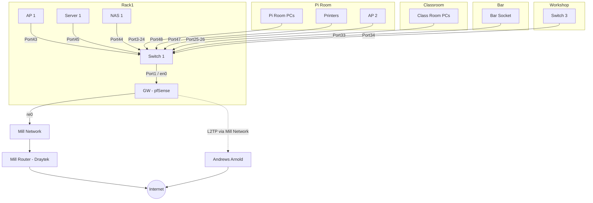
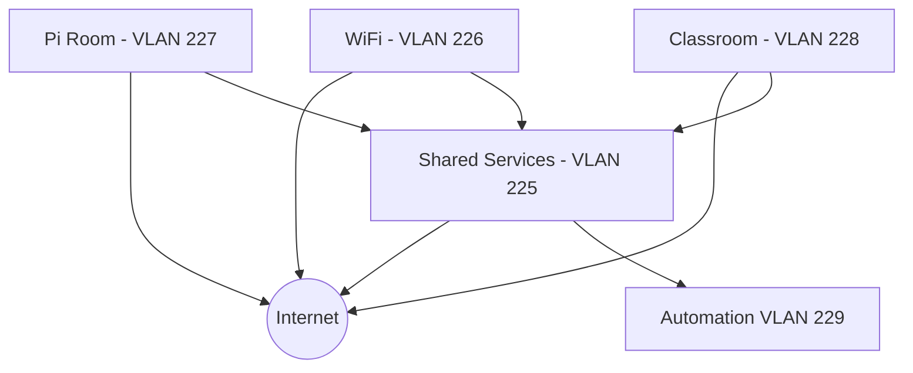

# Network Layout

## Hardware

| Name     | Manf    | Model          | Type      | Location    | Status                   | Notes                                  |
| -------- | ------- | -------------- | --------- | ----------- | ------------------------ | -------------------------------------- |
| GW       | HP      | Unknown        | Router    | Rack 1      | Live                     | HP desktop system running pfSense      |
| Switch 1 | Cisco   | Catalyst 3560G | L3 Switch | Rack 1      | Live                     | Serial console connected to USB on GW  |
| Switch 2 | Cisco   | Catalyst 3560G | L3 Switch | Rack 1      | Waiting to be installed  | Sandbox/Learning switch                |
| Switch 3 | HP      | Procurve 2824  | L2 Switch | Fabrication | Live                     | Switch for the fabrication area        |
| AP 1     | TP-Link |                | AP        | Top of Rack | Live                     | Uses stock firmware                    |
| AP 2     | ???     | ???            | AP        | Pi Room     | Live                     | Connects to Pi Room VLAN, needs fixing |
| NAS 1    | QNAP    | TS-431+        | NAS       | Rack 1      | Waiting software install |                                        |
| UPS      | APC     | ???            | UPS       | Rack 1      | Live                     |                                        |

## Physical Layout

Correct as of 2023-06-17

### GW - pfSense

We've got a small HP desktop system running pfSense with a quad port NIC, giving us 5 physical NICs. At the moment the motherboard NIC is connected to the Mill network, and the 4 port NIC is used for internal traffic.

| Port  | Connected to | Notes                          |
| ----- | ------------ | ------------------------------ |
| `re0` | Mill network |                                |
| `en0` | Switch 1     | Tagged only traffic, all VLANs |
| `en1` |              |                                |
| `en2` |              |                                |
| `en3` |              |                                |

## AP 1

WiFi is served by a router/AP on top of the rack. Its currently in 'dumb AP' mode, in that DHCP is disabled and we're not using any of the routing mode of the router itself. It has a 4 port switch and a 'Internet' port.

| Port       | Connected to | Notes |
| ---------- | ------------ | ----- |
| `Internet` |              |       |
| `Port1`    |              |       |
| `Port2`    |              |       |
| `Port3`    | Switch1      |       |
| `Port4`    |              |       |

## L3 Layout / VLANs

TL;DR: All VLANs can access Shared Services, Automation is only accessible via Shared Services.

### Mill Network - VLAN '101'

Our outbound internet route, should be treated as untrusted due to relatively little control over devices in other businesses.

IP Range: `192.168.0.0/16`

### Shared Services - VLAN 225

Where the servers, routers, and other central bits are hosted.

IP Range: `10.3.1.0/24`

This subnet doesn't have DHCP enabled, we use static assignment. Here is the current list:

| Device Name   | IP Address  | Location               |
| ------------- | ----------- | ---------------------- |
| GW            | `10.3.1.1`  | Rack 1                 |
| Switch 1      | `10.3.1.2`  | Rack 1                 |
| Server 1      | `10.3.1.3`  | Rack 1                 |
| Switch 3      | `10.3.1.4`  | Workshop / Fabrication |
| NAS 1         | `10.3.1.5`  | Rack 1                 |
| HP Printer    | `10.3.1.50` | Pi Room 5/7            |
| Epson Printer | `10.3.1.51` | Pi Room                |

### WiFi - VLAN 226

WiFi users, General open access to the internet and internal services.

IP Range: `10.3.2.0/24`

DHCP enabled, `10.3.2.11 - 10.3.2.254`

| Device Name | IP Address | Location                |
| ----------- | ---------- | ----------------------- |
| AP1         | `10.3.2.2` | On top of Rack 1        |
| AP2         | `10.3.2.3` | Pi Room behind Printers |
| AP3         | `10.3.2.4` | Bar above the door      |

### Pi Room - VLAN 227

Pi Room / Co-Working space. General open access to the internet and internal services.

IP Range: `10.3.14.0/24`

DHCP enabled, `10.3.14.2 - 10.3.14.254`

### Classroom - VLAN 228

Class room, General open access to the internet and internal services.

IP Range `10.3.15.0/24`

DHCP enabled, `10.3.15.2 - 10.3.15.254`

### Automation - VLAN 229

Used for any automation devices that do not require open internet access, or need to be secured away from the general network (e.g. Door system)

IP Range `10.3.16.0/24`

DHCP enabled, `10.3.16.2 - 10.3.16.128`

This subnet does have DHCP enabled, but we use some static assignment. Here is the current list:

| Device Name | IP Address | Location |
| ----------- | ---------- | -------- |
