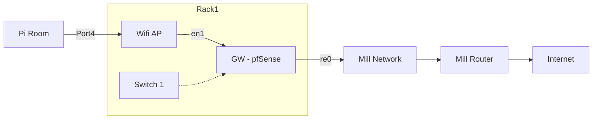
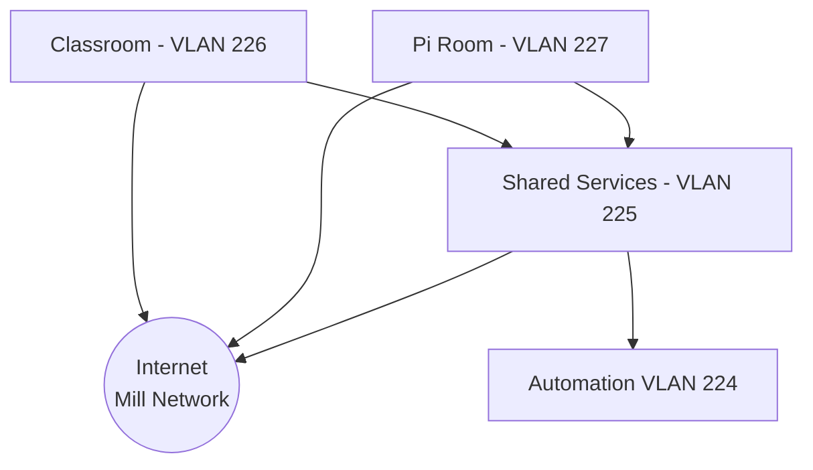

# Network Layout

## Hardware

| Name     | Manf    | Model   | Type      | Location    | Status                  | Notes                             |
| -------- | ------- | ------- | --------- | ----------- | ----------------------- | --------------------------------- |
| GW       | HP      | Unknown | Router    | Rack 1      | Live                    | HP desktop system running pfSense |
| Switch 1 | Cisco   | 3900    | L3 Switch | Rack 1      | Waiting to be installed |                                   |
| AP       | TP-Link |         | AP        | Top of Rack | Live                    | Uses stock firmware               |

## Physical Layout

Correct as of 2023-04-01

### GW - pfSense

We've got a small HP desktop system running pfSense with a quad port NIC, giving us 5 physical NICs. At the moment the motherboard NIC is connected to the Mill network, and the 4 port NIC is used for internal traffic.

| Port  | Connected to | Notes                                          |
| ----- | ------------ | ---------------------------------------------- |
| `re0` | Mill network |                                                |
| `en0` |              | Future connection to Switch1, all VLANs tagged |
| `en1` | WiFi AP      |                                                |
| `en2` |              |                                                |
| `en3` |              |                                                |

## Wifi AP

Wifi is served by a router/AP on top of the rack. Its currently in 'dumb AP' mode, in that DHCP is disabled and we're not using any of the routing mode of the router itself. It has a 4 port switch and a 'Internet' port.

| Port       | Connected to | Notes                                          |
| ---------- | ------------ | ---------------------------------------------- |
| `Internet` |              |                                                |
| `Port1`    |              |                                                |
| `Port2`    |              |                                                |
| `Port3`    | Pi Room      | Temporary link to a single port in the Pi Room |
| `Port4`    | GW           |                                                |

## L3 Layout / VLANs

### Mill Network - VLAN 101

Our outbound internet route, should be treated as untrusted due to relatively little control over devices in other businesses.

IP Range: `192.168.0.0/16`

### Shared Services - VLAN 225

Where the servers, routers, and other central bits are hosted.

IP Range: `10.3.1.0/24`

### Wifi - VLAN 226

Wifi users, General open access to the internet and internal services.

IP Range: `10.3.2.0/24`

### Pi Room - VLAN 227

Pi Room / Co-Working space. General open access to the internet and internal services.

IP Range: `10.3.14.0/24`

### Classroom - VLAN 228

Class room, General open access to the internet and internal services.

IP Range `10.3.15.0/24`

### Automation - VLAN 229

Used for any automation devices that do not require open internet access, or need to be secured away from the general network (e.g. Door system)

IP Range `10.3.16.0/24`