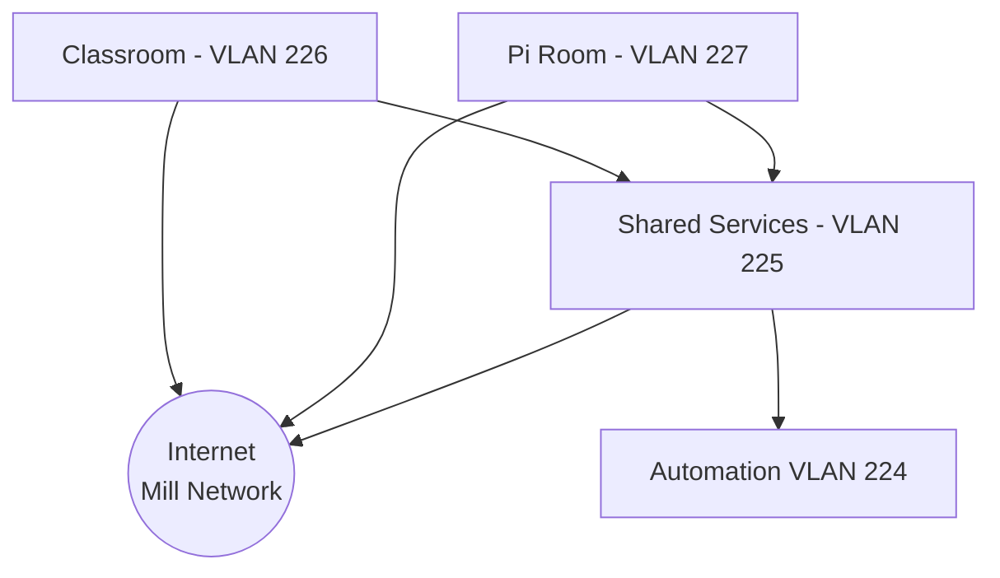

# Network Layout

## Hardware

| Name     | Manf    | Model    | Type      | Location    | Status | Notes                 |
| -------- | ------- | -------- | --------- | ----------- | ------ | --------------------- |
| Switch 1 | Cisco   | 3900     | L3 Switch | Rack        |        |                       |
| Server 1 | Dell    | R320 SFF | Server    | Rack        |        | Awaiting installation |
| Server 2 | Dell    | R320 LFF | Server    | Rack        |        | Awaiting installation |
| AP       | TP-Link |          | Router/AP | Top of Rack | Live   | Uses stock firmware   |

## Wifi

Wifi is served by a router/AP on top of the rack.

## VLANs

### Mill Network - VLAN 101

Our outbound internet route, should be treated as untrusted due to relatively little control over devices in other businesses.

IP Range: `192.168.0.0/16`

### Wifi - VLAN 225?

Wifi users, General open access to the internet and internal services.

IP Range: `10.3.1.0/24`

### Pi Room - VLAN 227

Pi Room / Co-Working space. General open access to the internet and internal services.

IP Range: `10.3.14.0/24`

### Classroom - VLAN 226

Class room, General open access to the internet and internal services.

IP Range `10.3.15.0/24`

### Automation - VLAN 224

Used for any automation devices that do not require open internet access, or need to be secured away from the general network (e.g. Door system)

IP Range `10.3.16.0/24`