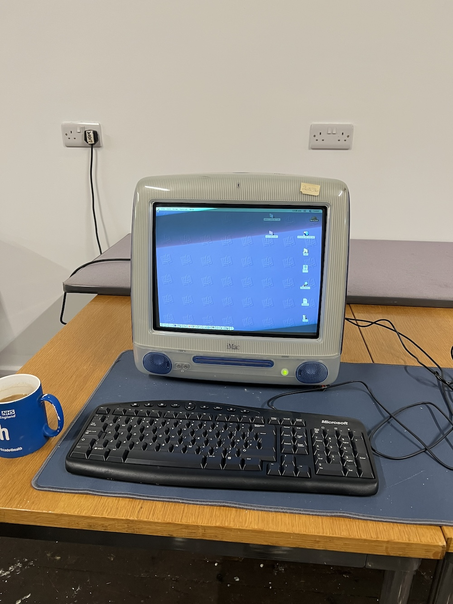

# iMac G3

The hackspace has owned a iMac G3 for a few years. 

## Specs

iMac G3 Blueberry slot loading, M5521, PowerMac2,1

* PowerPC 750 G3 350mhz
* 128MB PC100 RAM
* Running Mac OS 9.2.2

### Installed Software

* Mac OS 9.2.2
* USB Overdrive - unregistered (for two button mouse control).
* Simcity 2000, SimTower.
* Some LucasArts games, Monkey Island 1/2, Indiana Jones and the Fate of Atlantis.
* Prince of Persia.

### Accessories

No matching accessories, the hackspace has a Apple keybord and puck mouse but its not original to the Blueberry G3.

## Current Issues

* **Slot Loader fails** - The CD drive is temperamental, pushing the disk in forcedly works every time, but ejection can take 5-10 attempts. The more attempts seem to improve the response of the time. Suspecting that its gummed up with something.

## Resolved Issues

* Messed up OS9 installed fixed with a fresh install
* CRT blue tint resolved with some power on hours, didn't recur.

## Documentation

* [Service Manual](iMac_DV.pdf)

## Work Log

* 2024/02/17 - LiSO4 battery replaced with modern Saft battery, powered on and tested. Outer case given a clean. [Internals](internals.jpg) look fine and have no obvious issues.
* 2024/02/21 - Reinstalled Mac OS 9.2.2, and some software. Selected a better keyboard/mouse combo.